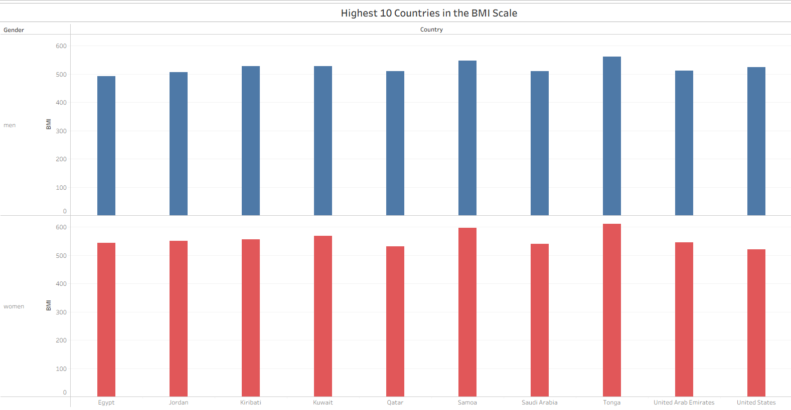
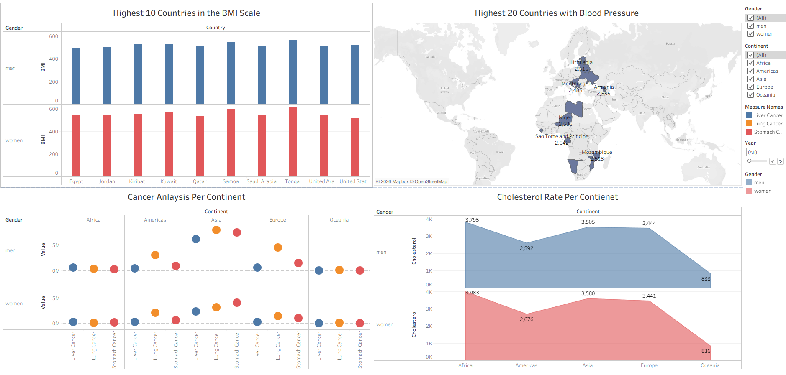

# 🌍 Global Health & Epidemiological Trends (Tableau Analytics)

An interactive Tableau data visualization project exploring global public health indicators, physiological risk factors, and cancer incidence across 159+ countries between 1990 and 2008, using curated data from the Gapminder Foundation.

---

## 📊 Project Overview

This project investigates epidemiological patterns across continents, focusing on the intersection of lifestyle-related biometrics (BMI, blood pressure, cholesterol) and cancer prevalence across genders and geographic regions.

### Key Objectives
* Identify geographic clusters exhibiting the highest average BMI and systolic blood pressure.
  
* Analyse demographic disparities between men and women regarding cardiovascular markers.
* Compare continental mortality patterns for lung, stomach, and liver cancers.
* Provide an interactive, responsive dashboard for cross-metric filtering.

---

## 📈 Dashboard Structure & Worksheets

The Tableau workbook (`Day_2_Task_2_Health_Survey (1).twb`) contains an integrated dashboard (`Dashboard 1`) designed for desktop and mobile layouts, comprising four core analytical views:

| Worksheet | Chart Type | Key Metrics Analysed | Filters / Interactivity |
| :--- | :--- | :--- | :--- |
| **Top 10 Countries by BMI** | Horizontal Bar Chart | `SUM(BMI)` segmented by `Gender` | Filtered to Top 10 countries; gender color-encoded |
| **Highest 20 Blood Pressure Countries** | Geographic Symbol Map | Multipolygon map with generated lat/long | Top 20 filter, gender breakdown, map tooltip cards |
| **Cancer Analysis Per Continent** | Multi-Measure Circle Plot | Liver, Lung, and Stomach Cancer rates | Categorical continent filter, measure color palette |
| **Cholesterol Rates Per Continent** | Area / Trend Distribution | Total Cholesterol by Continent & Year | Interactive Year slider (1990–2008), gender breakdown |

---

## 📁 Dataset Details

* **Source:** Gapminder Health Survey Data
* **Observation Period:** 1990 – 2008
* **Scope:** 159 countries across 5 continents (Africa, Americas, Asia, Europe, Oceania)
* **Variables:**
  * **Categorical / Demographics:** `Country`, `Continent`, `Year`, `Gender`
  * **Physiological Markers:** `BMI`, `Blood Pressure`, `Cholesterol`
  * **Epidemiological Measures:** `Lung Cancer`, `Liver Cancer`, `Stomach Cancer`, `Life Expectancy`
  * **Demographic Counts:** `Population`, `Population Growth`, `Number of Records`

---

## 🛠️ Tools & Technologies Used

* **Tableau Desktop / Tableau Public**
* **Hyper Data Extract Engine**
* **Git & GitHub** for version control and project documentation

---

## 👤 Author

* **Abdullah Al-Qadhi**
  * GitHub: [@Abdullah-Alqadhi89](https://github.com/Abdullah-Alqadhi89)
